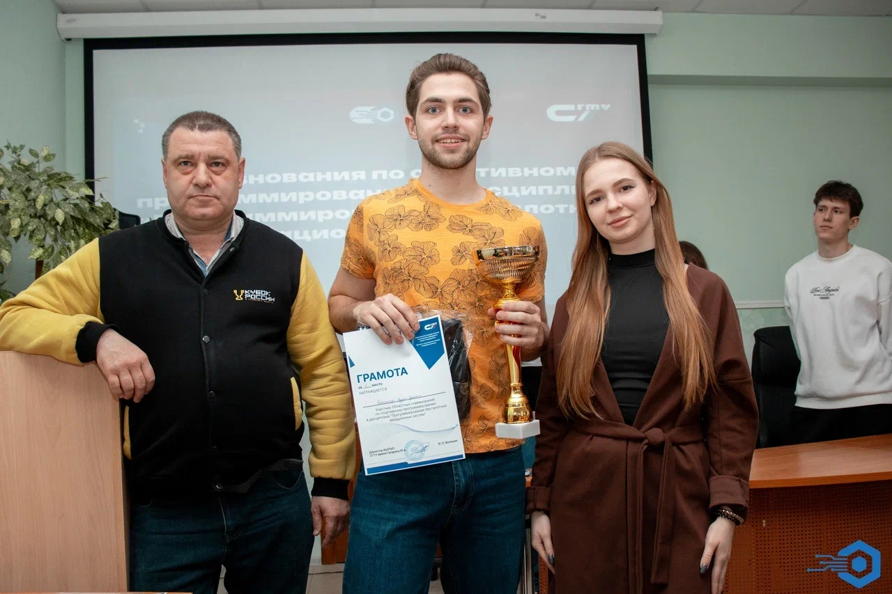

# Решение команды robolab_misis в рамках областных соревнований по спортивному программированию в дисциплине «программирование беспилотных авиационных систем»

# robolab_misis — автономное управление дроном на соревнованиях БПЛА


Решение команды **robolab_misis** для областных соревнований по спортивному программированию в дисциплине **«программирование беспилотных авиационных систем»**.

Проект представляет собой набор конфигураций, модулей и полётной миссии для автономного прохождения маршрута дроном на базе программируемой платформы **«Сверх»**, ROS/Clover-сервисов и PX4.

---

## Содержание

- [О проекте](#о-проекте)
- [Установка и запуск](#установка-и-запуск)
- [Основной функционал](#основной-функционал)
- [Технологии](#технологии)
- [Архитектура и структура проекта](#архитектура-и-структура-проекта)
- [Демонстрация](#демонстрация)
- [Результат](#результат)
- [Планы по развитию](#планы-по-развитию)
- [Лицензия](#лицензия)

---

## О проекте

В рамках практического этапа соревнований участникам нужно было за ограниченное время собрать, настроить и запрограммировать дрон для автономного прохождения маршрута, заданного судьями.

В репозитории представлены:

- конфигурационные файлы для дрона;
- параметры PX4 для конкретного решения;
- файл `mission.py`, описывающий автономную миссию полёта;
- модули для работы с одометрией, offboard-управлением, периферией, симуляцией и веб-интерфейсами.

Отборочный этап выполнялся в симуляторе **Gazebo** на компьютерах, предоставленных организаторами.

---

## Установка и запуск

> Проект рассчитан на запуск в подготовленном окружении ROS/PX4/SVERK.  
> Перед запуском на реальном дроне необходимо проверить конфигурацию, заряд аккумулятора, датчики и выполнять запуск только в безопасной зоне соревнований или лаборатории.

### 1. Клонирование репозитория

```bash
git clone --recurse-submodules https://github.com/AndReyt36/sport_dron.git
cd sport_dron
```

Если репозиторий уже был склонирован без подмодулей:

```bash
git submodule update --init --recursive
```

### 2. Установка зависимостей

Для работы проекта требуется подготовленное окружение с:

- ROS / ROS 2;
- PX4;
- Gazebo;
- Python 3;
- CMake / colcon;
- пакетами для работы с Clover/SVERK-дроном;
- драйверами сенсоров и периферии.

Пример установки базовых инструментов:

```bash
sudo apt update
sudo apt install python3 python3-pip cmake git
```

Для ROS 2 workspace:

```bash
source /opt/ros/<ros-distro>/setup.bash
colcon build
source install/setup.bash
```

Замените `<ros-distro>` на используемый дистрибутив ROS, например `humble`.

### 3. Запуск в симуляции

Если используется подготовленная симуляция:

```bash
source install/setup.bash
ros2 launch main_package <launch_file>.launch.py
```

### 4. Запуск миссии

Файл основной миссии:

```bash
mission.py
```

В подготовленном ROS/Clover-окружении запуск может выглядеть так:

```bash
python3 mission.py
```

Перед запуском убедитесь, что доступны необходимые сервисы управления дроном:

- `get_telemetry`;
- `navigate`;
- `set_position`;
- `land`;
- `led/set_effect`.

---

## Основной функционал

Проект реализует:

- автономное прохождение маршрута дроном;
- настройку параметров PX4 под конкретную сборку;
- работу с телеметрией дрона;
- выбор системы локализации;
- поддержку ArUco/map-локализации;
- fallback-режим движения относительно корпуса дрона;
- проверку безопасности перед выполнением команд;
- контроль высоты и напряжения аккумулятора;
- обработку данных с дальномеров;
- обнаружение препятствий перед дроном;
- безопасную посадку при ошибке или прерывании миссии;
- LED-индикацию состояний миссии;
- возможность запуска компонентов в симуляции.

---

## Технологии

В проекте используются:

- **Python** — описание автономной миссии и логики полёта;
- **C++** — компоненты ROS/PX4-инфраструктуры;
- **CMake / colcon** — сборка пакетов;
- **ROS / ROS 2** — взаимодействие компонентов робототехнической системы;
- **PX4** — автопилот и низкоуровневое управление дроном;
- **Gazebo** — симуляция полёта;
- **ArUco** — локализация по визуальным меткам;
- **Clover / SVERK services** — высокоуровневые сервисы управления дроном;
- **LED control** — визуальная индикация состояния миссии.

---

## Архитектура и структура проекта

```text
.
├── airframes                  # Конфигурации рам и параметров дронов
├── docs                       # Документация и дополнительные материалы
├── main_package               # Основной пакет для запуска системы
├── odometry                   # Модули одометрии и локализации
├── offboard                   # Offboard-управление дроном
├── peripheral                 # Работа с периферией: камера, LED, сенсоры
├── px4                        # Интеграция с PX4
├── simulation                 # Компоненты симуляции
├── sverk_interfaces           # Высокоуровневые интерфейсы управления
├── web                        # Веб-интерфейсы и мониторинг
├── custom_px4_params.params   # Кастомные параметры PX4
├── mission.py                 # Основная автономная миссия
└── README.md
```

### Общая схема работы

```text
          +-------------------+
          |     mission.py    |
          | Автономная логика |
          +---------+---------+
                    |
                    v
          +-------------------+
          |  ROS/Clover API   |
          | Сервисы управления|
          +---------+---------+
                    |
                    v
          +-------------------+
          |        PX4        |
          | Автопилот дрона  |
          +---------+---------+
                    |
                    v
          +-------------------+
          |  Дрон «Сверх»    |
          | Полёт и сенсоры  |
          +-------------------+
```

---

## Демонстрация

### Дрон во время практического этапа


### Работа команды


### Результат соревнований



---

## Результат

По итогам соревнований команда **robolab_misis** заняла **2 место**.

Проект показал, что за ограниченное время можно собрать, настроить и запрограммировать автономную систему управления дроном, способную выполнять маршрут в условиях соревнований.

---

## Планы по развитию

- Улучшить обработку данных с сенсоров;
- добавить более гибкие сценарии автономного прохождения маршрута;
- расширить поддержку симуляции;
- доработать визуализацию состояния миссии;
- повысить устойчивость алгоритмов при потере локализации.

---

## Лицензия

Проект распространяется под лицензией **MIT**.

Подробнее см. файл [LICENSE](LICENSE).
